# Enterprise SIEM Architecture Diagram

## Comprehensive System Architecture

This document provides detailed architecture diagrams for the Enterprise SIEM platform, showing all modules, their interactions, and data flows.

---

## 1. High-Level System Architecture

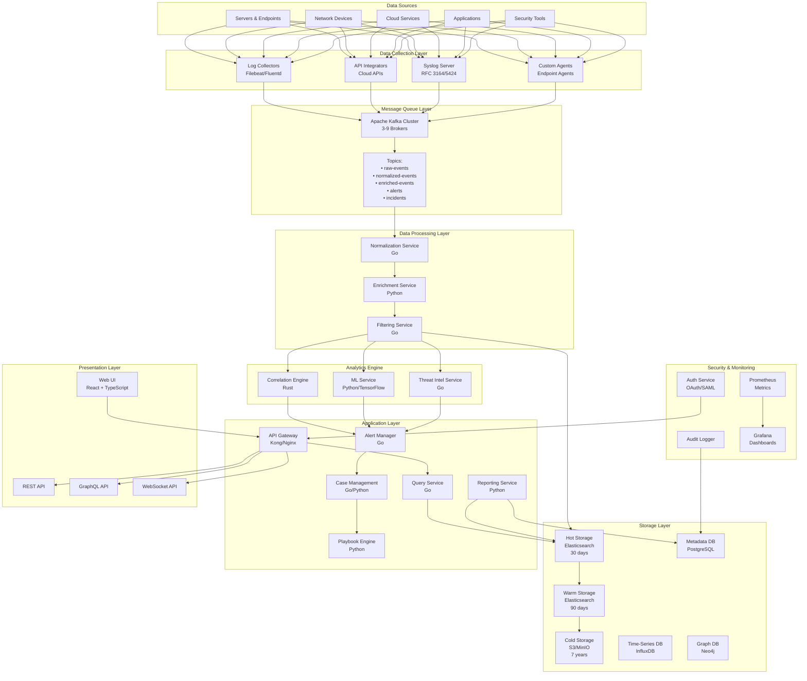

---

## 2. Detailed Module Architecture

### 2.1 Data Collection Layer

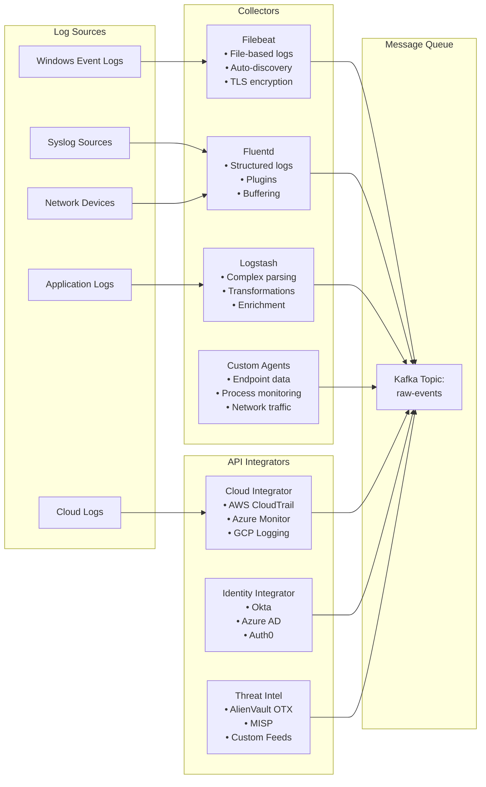

### 2.2 Data Processing Pipeline

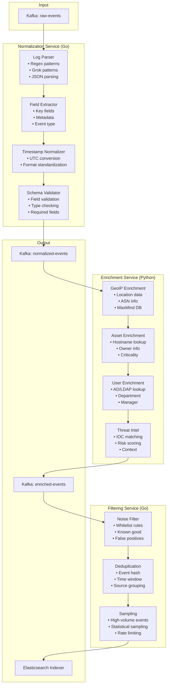

### 2.3 Analytics Engine Architecture

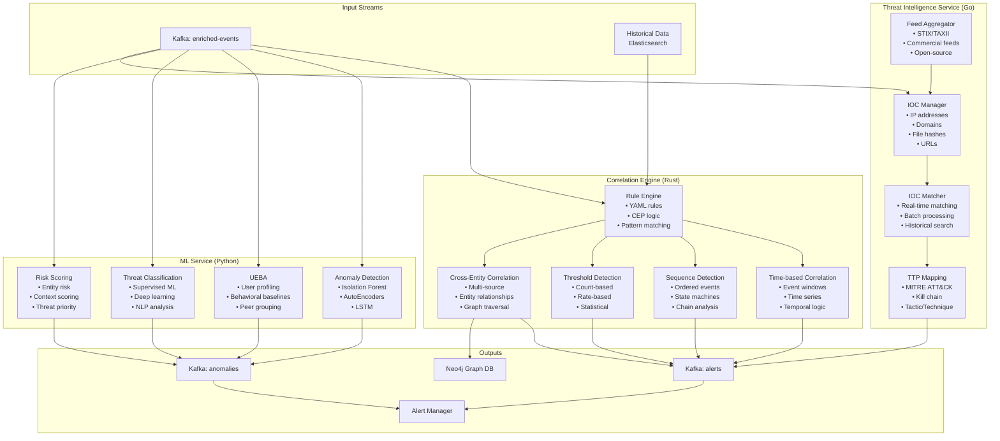

### 2.4 Storage Layer Architecture

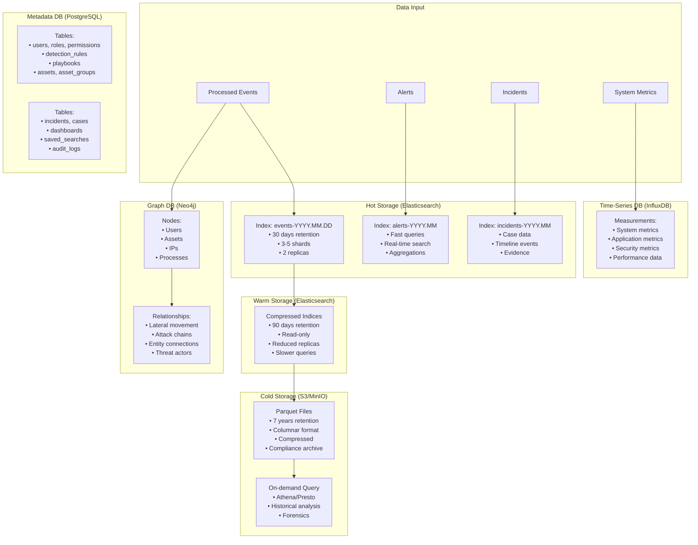

### 2.5 Application Layer Architecture

```mermaid
graph TB
    subgraph "API Gateway"
        AG1[Kong/Nginx<br/>• Load balancing<br/>• Rate limiting<br/>• Authentication]
        AG2[API Routing<br/>• REST endpoints<br/>• GraphQL<br/>• WebSocket<br/>• gRPC]
        AG3[Request Transform<br/>• Validation<br/>• Caching<br/>• Compression]
    end

    subgraph "Core Services"
        CS1[Alert Manager<br/>Go<br/>• Alert deduplication<br/>• Grouping<br/>• Escalation<br/>• Notifications]
        CS2[Case Management<br/>Go/Python<br/>• Incident workflow<br/>• Evidence collection<br/>• Timeline<br/>• Collaboration]
        CS3[Playbook Engine<br/>Python<br/>• Automation<br/>• Response actions<br/>• Workflow execution<br/>• Integration]
        CS4[Query Service<br/>Go<br/>• Search API<br/>• Aggregations<br/>• Filtering<br/>• Pagination]
        CS5[Reporting Service<br/>Python<br/>• Report generation<br/>• Compliance<br/>• Scheduling<br/>• Export (PDF/CSV)]
    end

    subgraph "Authentication & Authorization"
        AA1[Auth Service<br/>• SAML 2.0<br/>• OAuth 2.0<br/>• OIDC<br/>• MFA]
        AA2[RBAC Engine<br/>• Role management<br/>• Permissions<br/>• Data-level security<br/>• API authorization]
    end

    subgraph "Integration Services"
        IN1[SOAR Integration<br/>• Alert forwarding<br/>• Playbook sync<br/>• Bi-directional]
        IN2[Ticketing Integration<br/>• Jira<br/>• ServiceNow<br/>• Automatic creation]
        IN3[EDR/XDR Integration<br/>• Threat sharing<br/>• Response actions<br/>• Endpoint data]
    end

    subgraph "Notification Services"
        NS1[Email Service<br/>• SMTP<br/>• Templates<br/>• Attachments]
        NS2[Messaging Service<br/>• Slack<br/>• Teams<br/>• PagerDuty<br/>• Webhooks]
    end

    AG1 --> AG2 --> AG3
    AG3 --> CS1 & CS2 & CS3 & CS4 & CS5
    AG3 --> AA1
    AA1 --> AA2
    CS1 --> NS1 & NS2
    CS2 --> CS3
    CS3 --> IN1 & IN2 & IN3
```

### 2.6 Presentation Layer Architecture

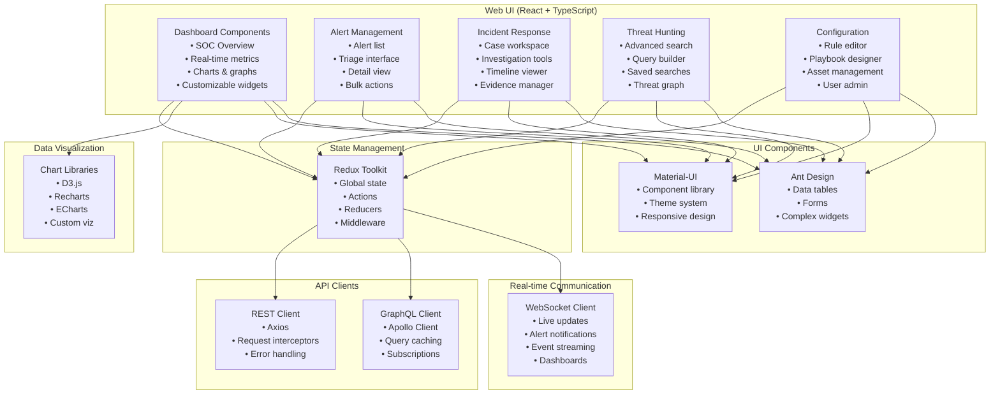

---

## 3. Data Flow Diagrams

### 3.1 Event Processing Flow

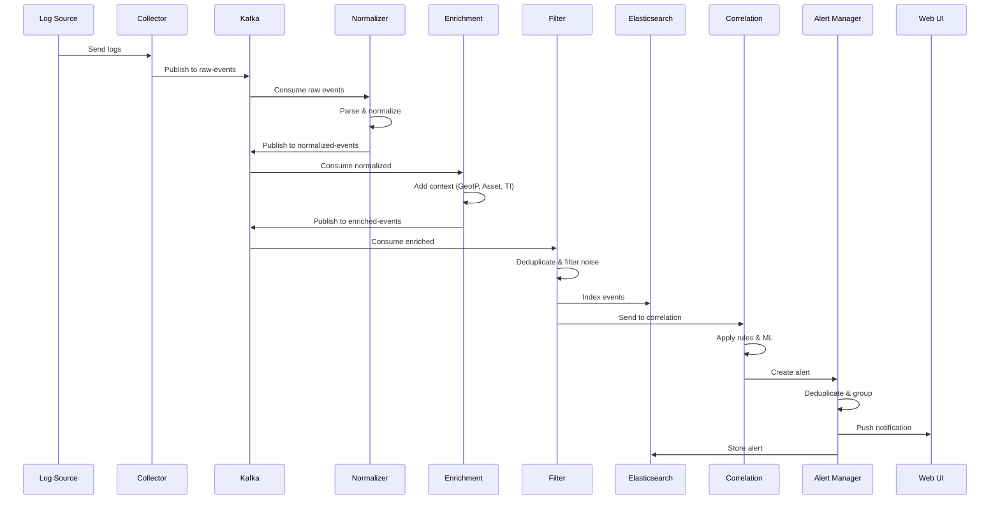

### 3.2 Incident Response Flow

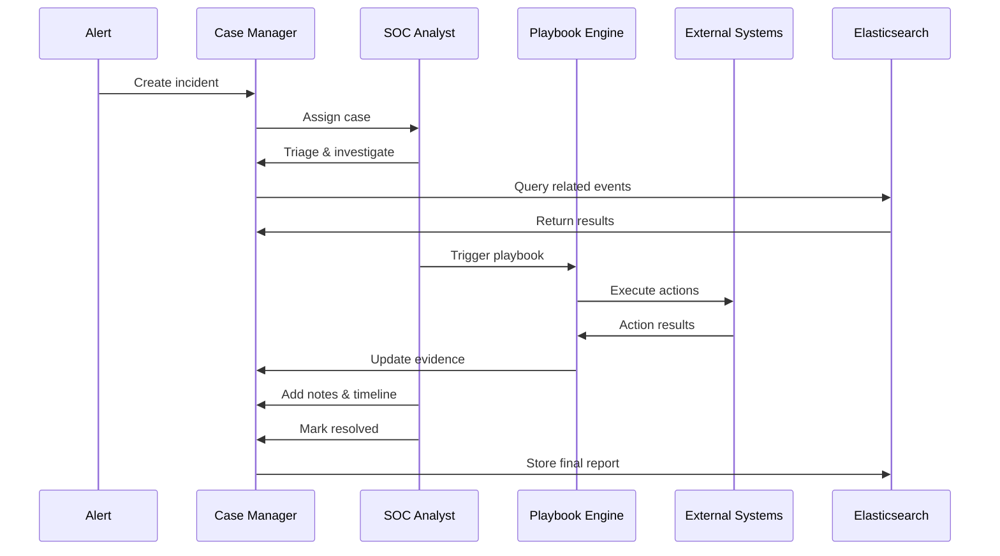

### 3.3 Query Flow

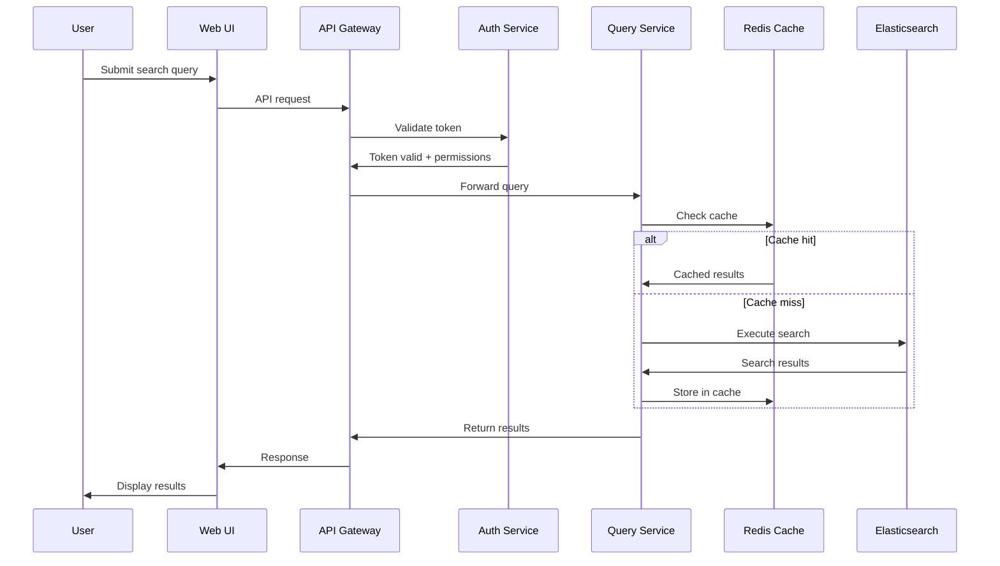

---

## 4. Deployment Architecture

### 4.1 Kubernetes Deployment

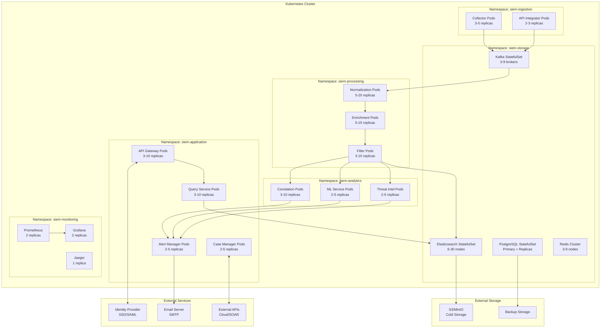

### 4.2 Service Mesh (Istio)

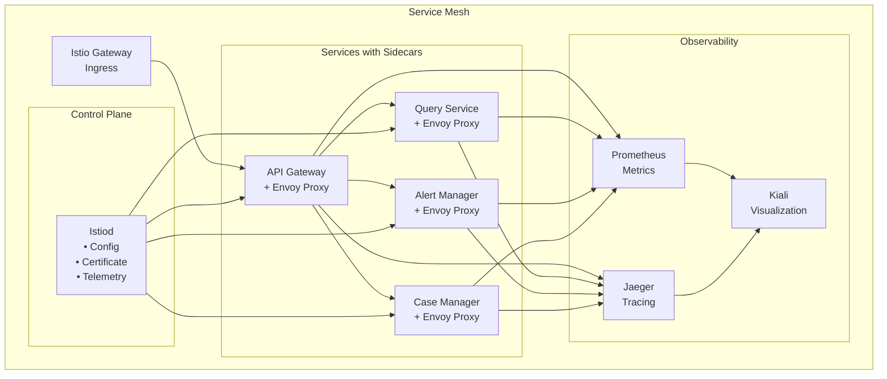

---

## 5. Security Architecture

### 5.1 Security Layers

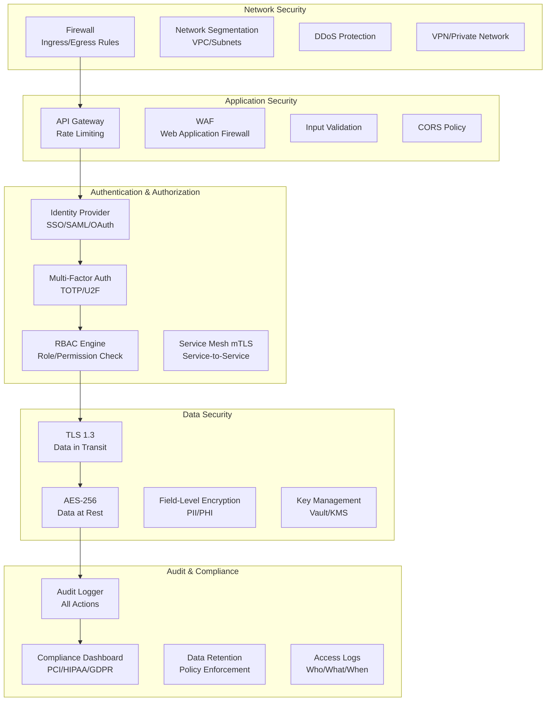

### 5.2 Zero-Trust Architecture

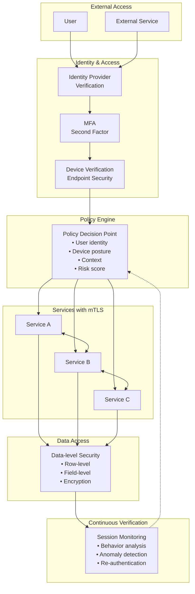

---

## 6. Scalability & High Availability

### 6.1 Auto-Scaling Strategy

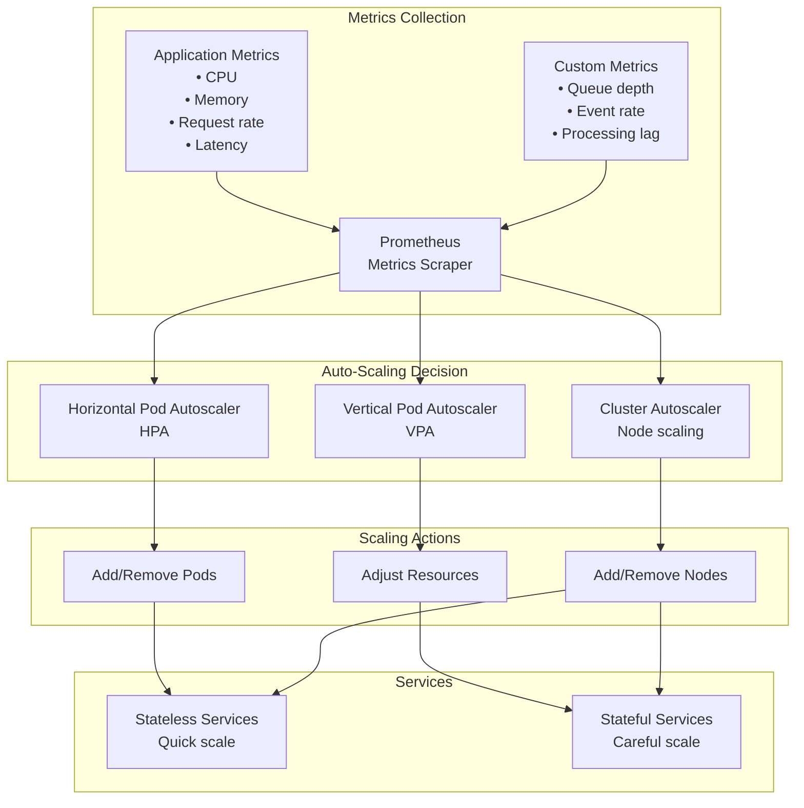

### 6.2 High Availability Setup

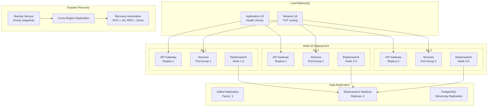

---

## 7. Integration Architecture

```mermaid
graph TB
    subgraph "SIEM Core"
        CORE[Enterprise SIEM<br/>Platform]
    end

    subgraph "SOAR Integration"
        SOAR1[Alert Forwarding<br/>Bi-directional]
        SOAR2[Playbook Sync<br/>Automation]
        SOAR3[Case Updates<br/>Status sync]
    end

    subgraph "Ticketing Systems"
        TIX1[Jira<br/>Incident tickets]
        TIX2[ServiceNow<br/>Change management]
        TIX3[PagerDuty<br/>On-call alerts]
    end

    subgraph "Security Tools"
        SEC1[EDR/XDR<br/>Endpoint data]
        SEC2[Firewall<br/>Network logs]
        SEC3[AV/EDR<br/>Threat detection]
        SEC4[DLP<br/>Data loss events]
    end

    subgraph "Identity Systems"
        ID1[Active Directory<br/>User data]
        ID2[Okta/Azure AD<br/>SSO/Auth logs]
        ID3[PAM<br/>Privileged access]
    end

    subgraph "Cloud Platforms"
        CL1[AWS<br/>CloudTrail, GuardDuty]
        CL2[Azure<br/>Monitor, Sentinel]
        CL3[GCP<br/>Logging, SCC]
    end

    subgraph "Threat Intelligence"
        TI1[Commercial Feeds<br/>Recorded Future]
        TI2[Open-source<br/>AlienVault OTX]
        TI3[MISP<br/>Community intel]
    end

    CORE <--> SOAR1 & SOAR2 & SOAR3
    CORE <--> TIX1 & TIX2 & TIX3
    CORE <--> SEC1 & SEC2 & SEC3 & SEC4
    CORE <--> ID1 & ID2 & ID3
    CORE <--> CL1 & CL2 & CL3
    CORE <--> TI1 & TI2 & TI3
```

---

## Summary

This comprehensive architecture diagram provides:

1. **High-Level Overview**: Complete system architecture with all major components
2. **Detailed Modules**: In-depth view of each layer and its components
3. **Data Flows**: Sequence diagrams showing event processing, incident response, and queries
4. **Deployment**: Kubernetes architecture and service mesh configuration
5. **Security**: Multi-layered security architecture and zero-trust model
6. **Scalability**: Auto-scaling and high availability strategies
7. **Integrations**: External system connections and data flows

### Key Technologies by Module

| Module | Primary Language | Key Technologies |
|--------|-----------------|------------------|
| Data Collection | N/A | Filebeat, Fluentd, Logstash |
| Message Queue | Java/Scala | Apache Kafka |
| Normalization | Go | Grok, Regex |
| Enrichment | Python | GeoIP, LDAP |
| Filtering | Go | Deduplication algorithms |
| Correlation | Rust | CEP, State machines |
| ML Service | Python | TensorFlow, PyTorch, scikit-learn |
| Threat Intel | Go | STIX/TAXII, MISP |
| Storage (Hot) | Java | Elasticsearch/OpenSearch |
| Storage (Cold) | N/A | S3/MinIO, Parquet |
| Storage (Meta) | C | PostgreSQL |
| Storage (TS) | Go | InfluxDB |
| Storage (Graph) | Java | Neo4j |
| API Gateway | Go/Lua | Kong, Nginx |
| Alert Manager | Go | Custom logic |
| Case Management | Go/Python | Workflow engine |
| Playbook Engine | Python | Automation framework |
| Reporting | Python | Jinja2, Pandas |
| Web UI | TypeScript | React, Redux, D3.js |

### Performance Characteristics

- **Ingestion Rate**: 100K+ events/second
- **Query Latency**: < 1 second (hot data)
- **Alert Generation**: < 1 second
- **Concurrent Users**: 10K+
- **Data Retention**: 7 years (tiered)
- **High Availability**: 99.9% uptime
- **Recovery Time Objective (RTO)**: < 1 hour
- **Recovery Point Objective (RPO)**: < 15 minutes
